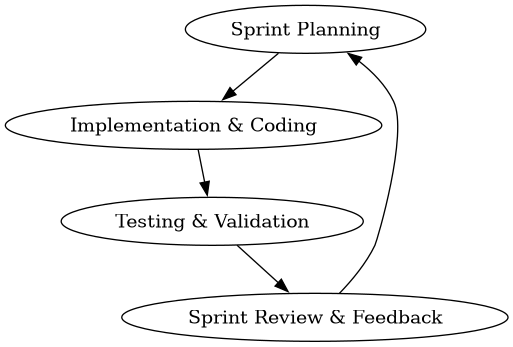
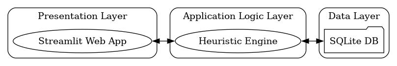
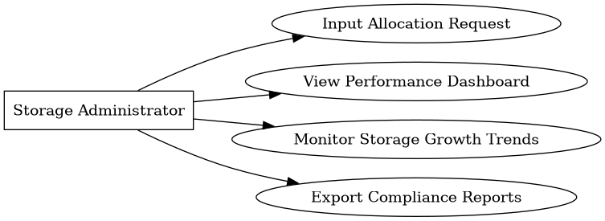
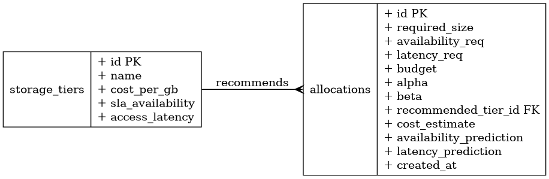
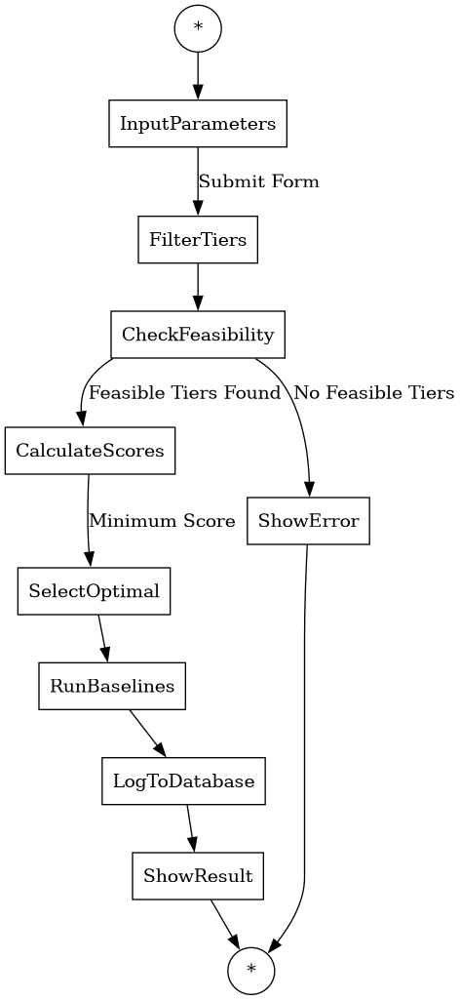

# CHAPTER THREE: METHODOLOGY AND SYSTEM DESIGN

## 3.0 Introduction
This chapter explains how the research and system development were carried out. It details the research methodology, requirements analysis, tools and technologies, system design, algorithm description, dataset properties, testing strategy, and ethical considerations for the SLA-Aware Storage Resource Allocation Optimizer.

---

## 3.1 Research Methodology

### 3.1.1 Research approach
This study adopts the **Design Science Research (DSR)** framework. DSR focuses on solving complex real-world problems through the creation, implementation, and evaluation of innovative human-designed artifacts (e.g., software applications, algorithms, or models). The software artifact developed in this project is a cost-reduction and SLA-aware cloud storage allocation simulation tool that utilizes a multi-objective greedy scoring heuristic.

### 3.1.2 Data collection methods
Because testing allocation algorithms in a live production cloud environment carries high costs and risks of data disruption, data collection is performed via simulation:
*   **Simulation Dataset:** A SQLite database (`storage_allocation.db`) containing storage tier specifications and allocation records based on technical specifications (SLA availability, cost, latency) of standard public cloud storage.
*   **Attributes Captured:** Data on user storage demand (size in GB), availability SLA targets (%), latency tolerance (ms), budget boundaries ($), and optimization weights (α, β) are collected and recorded.
*   **Mock Workload Generator:** A workload generation script (`mock_data.py`) generates random allocation scenarios to simulate realistic operational demand with varied storage requirements and SLA constraints.

### 3.1.3 System development methodology
The project employs the **Agile software development methodology**, specifically the **Scrum** framework. Agile Scrum is selected to accommodate iterative coding, testing, and supervisor feedback loops. Sprints are organized to incrementally deliver backend database logic, the recommendation scoring engine, and frontend web visualizations.



**Figure 3.1:** Agile Scrum Sprint Cycle showing iterative development process.

---

## 3.2 Requirements Analysis

### 3.2.1 Functional Requirements
Functional requirements define the specific actions the system must perform:
*   **FR1: Storage Parameter Input:** The system must capture user inputs for required size (GB), maximum latency (ms), target SLA availability (%), optional budget ($), and optimization weights (α, β) via Streamlit forms in `modules/allocation.py`.
*   **FR2: Heuristic Recommendation:** The system must compute allocation scores using the α-β dual-objective scoring algorithm in `heuristic.py` and recommend the optimal storage tier based on the lowest weighted score.
*   **FR3: Comparative Evaluation:** The system must execute baseline algorithms (First Fit, Best Fit, Worst Fit) under identical inputs to compare performance metrics, displaying results in a comparative table.
*   **FR4: Persistent Log Database:** The system must save recommendation records and performance evaluations to a local SQLite database via parameterized queries in `database.py`.
*   **FR5: Analytics Dashboard:** The system must render interactive Plotly charts showing storage utilization, costs, and compliance trends in `modules/dashboard.py`.
*   **FR6: Report Exporting:** The system must enable users to export all historical allocation records to a CSV file via the download functionality in `modules/reporting.py`.

### 3.2.2 Non-Functional Requirements
Non-functional requirements describe performance constraints and quality attributes of the system:
*   **NFR1: Performance & Speed:** The scoring heuristic must execute and return recommendations in less than 500 milliseconds. The current implementation uses vectorized Pandas operations for efficient computation.
*   **NFR2: Security:** All database transactions in `database.py` employ SQL parameterization (using `?` placeholders) to prevent SQL Injection attacks. Data is stored locally in `storage_allocation.db` to ensure access control.
*   **NFR3: Usability:** The Streamlit user interface provides intuitive forms with help tooltips, metric cards, and interactive Plotly visualizations that can be navigated with minimal training.
*   **NFR4: Reliability:** The system maintains consistent SQLite state through proper connection management and handles errors gracefully with informative messages when inputs are invalid or no feasible storage tier exists.

### 3.2.3 User Requirements / User Stories
User requirements explain system utility from the perspective of target users:
*   *User Story 1:* As a Storage Administrator, I want to input capacity, availability, and latency needs so that I can immediately find the most cost-effective cloud storage tier that meets my SLAs.
*   *User Story 2:* As a Cloud Provider, I want to adjust the slider weights ($\alpha$ and $\beta$) between cost and availability so that the algorithm's recommendations align with my changing business budgets and operational priorities.
*   *User Story 3:* As an IT Compliance Auditor, I want to view a historical log of all recommendations and export them so that I can verify that SLA targets are being consistently met.

---

## 3.3 Tools and Technologies Used

*   **Programming language(s):** **Python 3.8+** is selected for its high readability, extensive scientific libraries, and ease of mathematical scoring implementation.
*   **Frameworks/libraries:** **Streamlit** is used as the frontend framework for building the web application interface. **Pandas** is used for data frame manipulation and database query results. **Plotly Express** is utilized to generate interactive data visualizations (pie charts, bar charts, line graphs, scatter plots).
*   **Database systems:** **SQLite3** is used as the database backend. It is serverless, zero-configuration, and stores the schema and logs inside a single database file (`storage_allocation.db`). Database operations are handled through the `database.py` module.
*   **Development tools (e.g., IDEs):** **Visual Studio Code (VS Code)** is used as the primary Integrated Development Environment.

---

## 3.4 System Design

### 3.4.1 System architecture diagram
The system follows a three-tier architecture structure:



**Figure 3.2:** Three-tier system architecture showing Presentation, Application Logic, and Data layers.

*   **Presentation Layer:** Provides the Web UI through `app.py` and modular pages (`modules/dashboard.py`, `modules/allocation.py`, `modules/monitoring.py`, `modules/reporting.py`) with input forms and data visualizations.
*   **Application Logic Layer:** Houses `heuristic.py` which runs the allocation scoring calculations and selects tiers using the α-β dual-objective algorithm.
*   **Data Layer:** Stores historical recommendations and storage tier metrics in SQLite through `database.py` with parameterized queries.

### 3.4.2 Use case diagram
The use case diagram highlights the interactions available to the Storage Administrator:



**Figure 3.3:** Use case diagram showing Storage Administrator interactions with the system.

### 3.4.3 Database design (ERD)
The database schema consists of a one-to-many relationship between storage tiers and allocations:



**Figure 3.4:** Entity Relationship Diagram showing one-to-many relationship between storage_tiers and allocations tables.

### 3.4.4 Activity diagram
The activity diagram models the operational logic flow when generating a storage recommendation:



**Figure 3.5:** Activity diagram showing the operational logic flow for generating storage recommendations.

### 3.4.5 Input design
The input interface features:
1.  A Streamlit sidebar selector to toggle between Dashboard, Allocation Simulation, Performance Monitoring, and Reporting & Evaluation screens.
2.  Input numeric forms in `modules/allocation.py` for required storage size (GB), maximum access latency (ms), target availability (selectbox with predefined SLA levels), and optional budget constraints.
3.  An interactive slider to configure cost optimization priority (α), which dynamically scales the unavailability weight (β = 1.0 - α). The slider ranges from 0.0 to 1.0 with a step of 0.1.
4.  Form submission button that triggers the heuristic algorithm and displays results.

### 3.4.6 Output design
The output interface presents results dynamically:
1.  KPI metric cards showing the Recommended Tier, Estimated Cost ($), Availability SLA (%), Access Latency (ms), and Weights (α/β).
2.  A structured DataFrame table comparing the proposed heuristic results against First Fit, Best Fit, and Worst Fit baselines with feasibility indicators.
3.  Interactive Plotly charts: pie charts for cost distribution by tier, bar charts for allocation size by tier, line graphs for cumulative storage growth over time, area charts for cost trends, and scatter plots for allocation profiles.
4.  Historical allocation tables with SLA compliance indicators and CSV export functionality.

---

## 3.5 Algorithm / Model Description

### 3.5.1 Algorithm / Pseudocode or flowchart
The proposed system uses a **multi-objective greedy scoring heuristic**. Cost and unavailability are normalized via Min-Max scaling to ensure that difference in units ($ vs %) does not distort the score:

$$C_{\text{norm}}(i) = \frac{\text{Cost}(i) - \text{Cost}_{\text{min}}}{\text{Cost}_{\text{max}} - \text{Cost}_{\text{min}}}$$

$$U_{\text{norm}}(i) = \frac{\text{Unavailability}(i) - \text{Unavailability}_{\text{min}}}{\text{Unavailability}_{\text{max}} - \text{Unavailability}_{\text{min}}}$$

Where:
$$\text{Unavailability}(i) = 1.0 - \left( \frac{\text{Availability}(i)}{100} \right)$$

The final score for storage tier $i$ is:
$$\text{Score}(i) = \alpha \times C_{\text{norm}}(i) + \beta \times U_{\text{norm}}(i)$$

Subject to:
$$\text{Availability}(i) \ge \text{Availability Requirement}$$
$$\text{Latency}(i) \le \text{Latency Requirement}$$
$$\text{Cost}(i) \le \text{Budget Constraint}$$
$$\alpha + \beta = 1.0$$

The exact pseudocode logic of the core algorithm is described below:

```text
ALGORITHM allocate_storage
    INPUT: required_size, availability_req, latency_req, budget, alpha, beta
    OUTPUT: recommended_tier, cost_estimate, availability_pred, latency_pred, baselines

    // Step 1: Query all storage tiers from SQLite via database.get_storage_tiers()
    tiers_df = GET_ALL_STORAGE_TIERS()
    
    // Step 2: Filter by availability SLA and access latency constraints
    eligible_tiers = tiers_df[
        (tiers_df['sla_availability'] >= availability_req) &
        (tiers_df['access_latency'] <= latency_req)
    ].copy()
    
    IF eligible_tiers is empty THEN
        RETURN Failure("No single storage tier meets both Availability and Latency requirements")
    END IF
    
    // Step 3: Calculate estimated cost for each eligible tier
    eligible_tiers['total_cost'] = eligible_tiers['cost_per_gb'] * required_size
    
    // Step 4: Filter by budget if provided
    IF budget IS NOT NULL AND budget > 0 THEN
        budget_eligible = eligible_tiers[eligible_tiers['total_cost'] <= budget]
        IF budget_eligible is empty THEN
            min_cost_tier = eligible_tiers.loc[eligible_tiers['total_cost'].idxmin()]
            RETURN Failure(f"No storage tier meets requirements within budget. Closest: {min_cost_tier['name']} at ${min_cost_tier['total_cost']:.2f}")
        END IF
        eligible_tiers = budget_eligible.copy()
    END IF
    
    // Step 5: Compute Unavailability and Min-Max Limits for normalization
    eligible_tiers['unavailability'] = 1.0 - (eligible_tiers['sla_availability'] / 100.0)
    
    min_cost = eligible_tiers['total_cost'].min()
    max_cost = eligible_tiers['total_cost'].max()
    min_unavail = eligible_tiers['unavailability'].min()
    max_unavail = eligible_tiers['unavailability'].max()
    
    cost_range = max_cost - min_cost
    unavail_range = max_unavail - min_unavail
    
    // Step 6: Calculate Normalized Weighted Score for each tier
    FOR EACH tier IN eligible_tiers:
        c_norm = (cost_range > 0) ? (tier.total_cost - min_cost) / cost_range : 0.0
        u_norm = (unavail_range > 0) ? (tier.unavailability - min_unavail) / unavail_range : 0.0
        tier.score = alpha * c_norm + beta * u_norm
    
    // Step 7: Select tier with Minimum Score
    best_tier = eligible_tiers.loc[eligible_tiers['score'].idxmin()]
    
    // Step 8: Compute Baselines for comparison
    first_fit = ALLOCATE_FIRST_FIT(tiers_df, required_size, availability_req, latency_req)
    best_fit = ALLOCATE_BEST_FIT(tiers_df, required_size, availability_req, latency_req)
    worst_fit = ALLOCATE_WORST_FIT(tiers_df, required_size, availability_req, latency_req)
    
    // Step 9: Return comprehensive results
    RETURN Success(best_tier, first_fit, best_fit, worst_fit)
END ALGORITHM
```

---

## 3.6 Data Description / Dataset

### 3.6.1 Source of data
The system utilizes simulated workload dataset profiles built on standard public cloud storage tier specifications. The configurations (Block, File, Object) are sourced from standard commercial cloud storage profiles (e.g., AWS EBS, Azure Files, GCP Cloud Storage) to ensure realistic parameters.

### 3.6.2 Size and format
*   **Format:** Relational SQLite Database file (`storage_allocation.db`) with two tables: `storage_tiers` and `allocations`.
*   **Tiers Data Size:** 3 pre-configured tiers (Block Storage, File Storage, Object Storage), each with properties (Name, Cost/GB, SLA Availability %, Access Latency ms).
*   **Allocations Data Size:** Dynamic transaction records generated through user interactions and optional mock data generation. The mock generator (`mock_data.py`) can pre-populate sample transactions representing various requests spread over time.
*   **Data Schema:** The `allocations` table stores 11 fields including required_size, availability_req, latency_req, budget, alpha, beta, recommended_tier_id, cost_estimate, availability_prediction, latency_prediction, and created_at timestamp.

### 3.6.3 Preprocessing steps
Before executing the multi-objective scoring evaluation:
1.  **Metric Filtering:** Requests are filtered by boolean conditions (SLA availability $\ge$ requested availability, latency $\le$ requested latency).
2.  **Unavailability Conversion:** The availability percentages (99.0% to 99.999%) are converted to unavailability rates (0.01 to 0.00001) for minimizability.
3.  **Min-Max Scaling:** Cost and unavailability values are scaled between 0.0 and 1.0 to standardize mathematical dimensions.

---

## 3.7 Validation or Testing Plan

### 3.7.1 How the system will be tested
The system is validated dynamically through the Streamlit interface. We supply range boundaries (boundary value analysis) and typical requests (equivalence partitioning) to the recommendation engine to verify that:
*   It recommends the cheapest tier when $\alpha = 1.0$ (cost-optimized mode).
*   It recommends the most reliable tier when $\alpha = 0.0$ (availability-optimized mode).
*   It logs entries to SQLite correctly via parameterized queries.
*   The comparative baseline algorithms (First Fit, Best Fit, Worst Fit) produce expected results.
*   Budget constraints are properly enforced when specified.

### 3.7.2 Types of testing
*   **Unit testing:** Core mathematical calculations and baseline algorithms in `heuristic.py` can be isolated and tested to verify score outputs and tier selection logic.
*   **Integration testing:** Ensures that database writing routines (`database.py`) and result displays in Streamlit modules run cooperatively with `heuristic.py`.
*   **User testing (UI Validation):** Streamlit UI is tested to confirm forms, error dialogs, Plotly charts, metric cards, and CSV download mechanisms run correctly across all four modules (Dashboard, Allocation, Monitoring, Reporting).

---

## 3.8 Ethical Considerations

### 3.8.1 Data privacy
The software uses purely synthetic workload metadata representing infrastructure requests (required size in GB, milliseconds latency, SLA percentage). No personal data, IP addresses, user accounts, or private organization files are processed or stored.

### 3.8.2 Consent (if human data used)
Because the research is conducted purely using simulated cloud infrastructure metadata and public cloud pricing models, no human subjects are involved. Consequently, ethical consent approvals and human subject forms are not required.

### 3.8.3 Security considerations
Security is enforced locally by securing the application directory. Parameterized SQLite inputs are used throughout the application code to eliminate the risk of database compromise via SQL Injection attacks.
