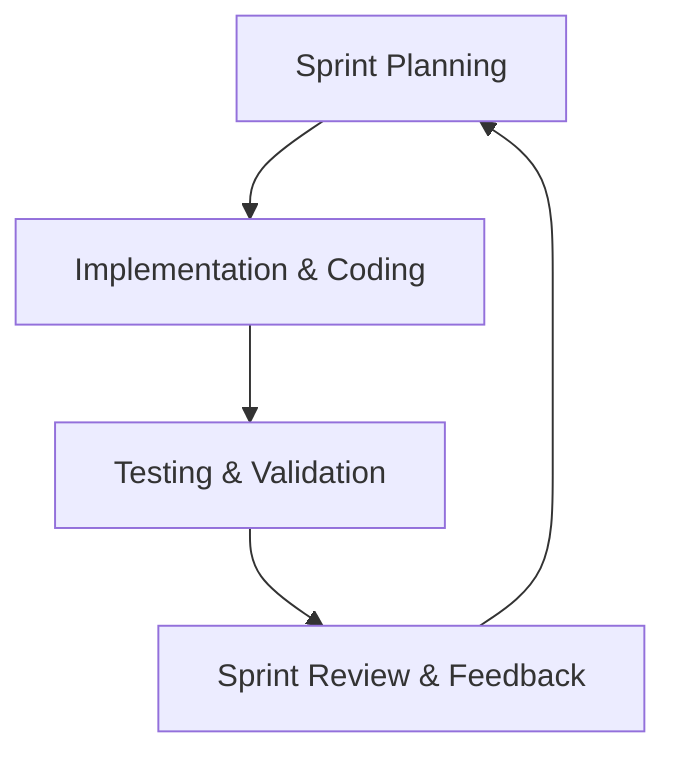
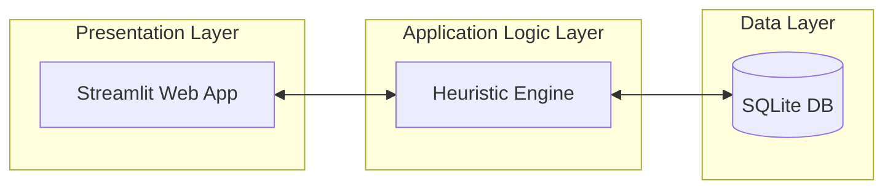
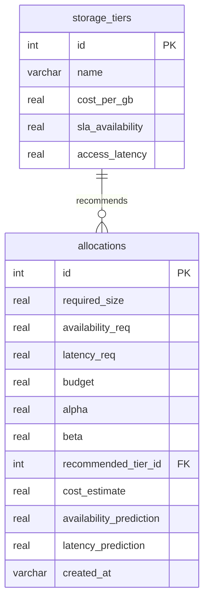
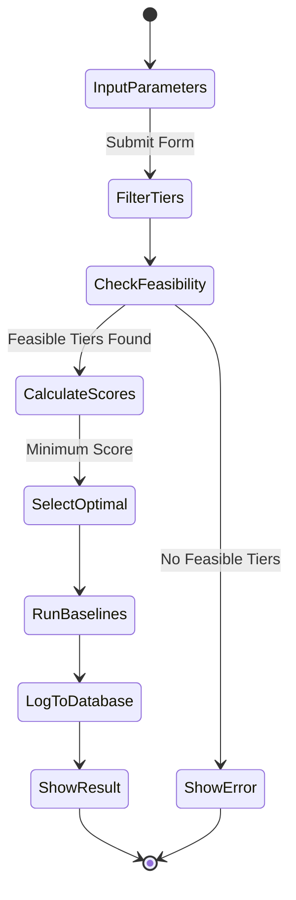

# CHAPTER THREE: METHODOLOGY AND SYSTEM DESIGN

## 3.0 Introduction
This chapter explains how the research and system development were carried out. It details the research methodology, requirements analysis, tools and technologies, system design, algorithm description, dataset properties, testing strategy, and ethical considerations for the SLA-Aware Storage Resource Allocation Optimizer.

---

## 3.1 Research Methodology

### 3.1.1 Research approach
This study adopts the **Design Science Research (DSR)** framework. DSR focuses on solving complex real-world problems through the creation, implementation, and evaluation of innovative human-designed artifacts (e.g., software applications, algorithms, or models). The software artifact developed in this project is a cost-reduction and SLA-aware cloud storage allocation simulation tool that utilizes a multi-objective greedy scoring heuristic.

### 3.1.2 Data collection methods
Because testing allocation algorithms in a live production cloud environment carries high costs and risks of data disruption, data collection is performed via simulation:
*   **Simulation Dataset:** A database of requests is created based on the technical specifications (SLA availability, cost, latency) of standard public cloud storage.
*   **Attributes Captured:** Data on user storage demand (size in GB), availability SLA targets (%), latency tolerance (ms), and budget boundaries ($) are collected and recorded.
*   **Mock Workload Generator:** A workload generation script (`mock_data.py`) generates random allocation scenarios to simulate realistic operational demand.

### 3.1.3 System development methodology
The project employs the **Agile software development methodology**, specifically the **Scrum** framework. Agile Scrum is selected to accommodate iterative coding, testing, and supervisor feedback loops. Sprints are organized to incrementally deliver backend database logic, the recommendation scoring engine, and frontend web visualizations.



---

## 3.2 Requirements Analysis

### 3.2.1 Functional Requirements
Functional requirements define the specific actions the system must perform:
*   **FR1: Storage Parameter Input:** The system must capture user inputs for required size (GB), maximum latency (ms), target SLA availability (%), and optional budget ($).
*   **FR2: Heuristic Recommendation:** The system must compute allocation scores and recommend the optimal storage tier based on the lowest score.
*   **FR3: Comparative Evaluation:** The system must execute baseline algorithms (First Fit, Best Fit, Worst Fit) under identical inputs to compare performance metrics.
*   **FR4: Persistent Log Database:** The system must save recommendation records and performance evaluations to a local database.
*   **FR5: Analytics Dashboard:** The system must render interactive charts showing storage utilization, costs, and compliance trends.
*   **FR6: Report Exporting:** The system must enable users to export all historical allocation records to a CSV file.

### 3.2.2 Non-Functional Requirements
Non-functional requirements describe performance constraints and quality attributes of the system:
*   **NFR1: Performance & Speed:** The scoring heuristic must execute and return recommendations in less than 500 milliseconds.
*   **NFR2: Security:** All database transactions must employ SQL parameterization to prevent SQL Injection, and data must be stored locally to ensure access control.
*   **NFR3: Usability:** The user interface must be intuitive, displaying forms, indicators, and help tooltips that can be navigated with minimal training.
*   **NFR4: Reliability:** The system must maintain consistent SQLite state and handle errors gracefully when inputs are empty or no feasible storage tier exists.

### 3.2.3 User Requirements / User Stories
User requirements explain system utility from the perspective of target users:
*   *User Story 1:* As a Storage Administrator, I want to input capacity, availability, and latency needs so that I can immediately find the most cost-effective cloud storage tier that meets my SLAs.
*   *User Story 2:* As a Cloud Provider, I want to adjust the slider weights ($\alpha$ and $\beta$) between cost and availability so that the algorithm's recommendations align with my changing business budgets and operational priorities.
*   *User Story 3:* As an IT Compliance Auditor, I want to view a historical log of all recommendations and export them so that I can verify that SLA targets are being consistently met.

---

## 3.3 Tools and Technologies Used

*   **Programming language(s):** **Python 3.8+** is selected for its high readability, extensive scientific libraries, and ease of mathematical scoring implementation.
*   **Frameworks/libraries:** **Streamlit (v1.32.2)** is used as the frontend framework. **Pandas** and **NumPy** are used for data frame manipulation and numeric arrays. **Plotly Express** is utilized to generate interactive data visualizations.
*   **Database systems:** **SQLite3** is used as the database backend. It is serverless, zero-configuration, and stores the schema and logs inside a single database file (`storage_allocation.db`).
*   **Development tools (e.g., IDEs):** **Visual Studio Code (VS Code)** is used as the primary Integrated Development Environment.

---

## 3.4 System Design

### 3.4.1 System architecture diagram
The system follows a three-tier architecture structure:



*   **Presentation Layer:** Provides the Web UI, input forms, and data visualizations.
*   **Application Logic Layer:** Houses `heuristic.py` which runs the allocation scoring calculations and selects tiers.
*   **Data Layer:** Stores historical recommendations and storage tier metrics in SQLite.

### 3.4.2 Use case diagram
The use case diagram highlights the interactions available to the Storage Administrator:

```mermaid
usecaseDiagram
    actor "Storage Administrator" as Admin
    
    Admin --> (Input Allocation Request)
    Admin --> (View Performance Dashboard)
    Admin --> (Monitor Storage Growth Trends)
    Admin --> (Export Compliance Reports)
```

### 3.4.3 Database design (ERD)
The database schema consists of a one-to-many relationship between storage tiers and allocations:



### 3.4.4 Activity diagram
The activity diagram models the operational logic flow when generating a storage recommendation:



### 3.4.5 Input design
The input interface features:
1.  A Streamlit sidebar selector to toggle between Dashboard, Simulation, Monitoring, and Reporting screens.
2.  Input numeric forms for size, maximum access latency, target availability selectboxes, and budget inputs.
3.  An interactive slider to configure cost optimization priority ($\alpha$), which dynamically scales the unavailability weight ($\beta = 1.0 - \alpha$).

### 3.4.6 Output design
The output interface presents results dynamically:
1.  KPI metric cards showing the Recommended Tier, Estimated Cost ($), Availability SLA (%), and Access Latency (ms).
2.  A structured DataFrame table comparing the proposed heuristic results against First Fit, Best Fit, and Worst Fit baselines.
3.  Interactive Plotly area and line graphs representing cumulative storage growth and cost over time.

---

## 3.5 Algorithm / Model Description

### 3.5.1 Algorithm / Pseudocode or flowchart
The proposed system uses a **multi-objective greedy scoring heuristic**. Cost and unavailability are normalized via Min-Max scaling to ensure that difference in units ($ vs %) does not distort the score:

$$C_{\text{norm}}(i) = \frac{\text{Cost}(i) - \text{Cost}_{\text{min}}}{\text{Cost}_{\text{max}} - \text{Cost}_{\text{min}}}$$

$$U_{\text{norm}}(i) = \frac{\text{Unavailability}(i) - \text{Unavailability}_{\text{min}}}{\text{Unavailability}_{\text{max}} - \text{Unavailability}_{\text{min}}}$$

Where:
$$\text{Unavailability}(i) = 1.0 - \left( \frac{\text{Availability}(i)}{100} \right)$$

The final score for storage tier $i$ is:
$$\text{Score}(i) = \alpha \times C_{\text{norm}}(i) + \beta \times U_{\text{norm}}(i)$$

Subject to:
$$\text{Availability}(i) \ge \text{Availability Requirement}$$
$$\text{Latency}(i) \le \text{Latency Requirement}$$
$$\text{Cost}(i) \le \text{Budget Constraint}$$
$$\alpha + \beta = 1.0$$

The exact pseudocode logic of the core algorithm is described below:

```text
ALGORITHM allocate_storage
    INPUT: required_size, availability_req, latency_req, budget, alpha, beta
    OUTPUT: recommended_tier, cost_estimate, availability_pred, latency_pred, baselines

    // Step 1: Query all storage tiers from SQLite
    tiers = GET_ALL_STORAGE_TIERS()
    
    // Step 2: Filter by constraints
    eligible_tiers = []
    FOR EACH tier IN tiers:
        IF tier.sla_availability >= availability_req AND tier.access_latency <= latency_req THEN
            tier.total_cost = tier.cost_per_gb * required_size
            IF budget IS NULL OR tier.total_cost <= budget THEN
                ADD tier TO eligible_tiers
            END IF
        END IF
    
    IF eligible_tiers is empty THEN
        RETURN Failure("No feasible storage tier meets requirements")
    END IF

    // Step 3: Compute Unavailability and Min-Max Limits
    FOR EACH tier IN eligible_tiers:
        tier.unavailability = 1.0 - (tier.sla_availability / 100.0)

    min_cost = MIN(eligible_tiers.total_cost)
    max_cost = MAX(eligible_tiers.total_cost)
    min_unavail = MIN(eligible_tiers.unavailability)
    max_unavail = MAX(eligible_tiers.unavailability)

    cost_range = max_cost - min_cost
    unavail_range = max_unavail - min_unavail

    // Step 4: Calculate Normalized Weighted Score
    FOR EACH tier IN eligible_tiers:
        c_norm = (cost_range > 0) ? (tier.total_cost - min_cost) / cost_range : 0.0
        u_norm = (unavail_range > 0) ? (tier.unavailability - min_unavail) / unavail_range : 0.0
        tier.score = alpha * c_norm + beta * u_norm

    // Step 5: Select Minimum Score
    best_tier = tier IN eligible_tiers WITH MINIMUM tier.score
    
    // Step 6: Compute Baselines
    first_fit = SELECT_FIRST_FIT(tiers, required_size, availability_req, latency_req)
    best_fit = SELECT_BEST_FIT(eligible_tiers, availability_req)
    worst_fit = SELECT_WORST_FIT(eligible_tiers, availability_req)

    RETURN Success(best_tier, first_fit, best_fit, worst_fit)
END ALGORITHM
```

---

## 3.6 Data Description / Dataset

### 3.6.1 Source of data
The system utilizes simulated workload dataset profiles built on standard public cloud storage tier specifications. The configurations (Block, File, Object) are sourced from standard commercial cloud storage profiles (e.g., AWS EBS, Azure Files, GCP Cloud Storage) to ensure realistic parameters.

### 3.6.2 Size and format
*   **Format:** Relational SQLite Database file (`storage_allocation.db`).
*   **Tiers Data Size:** 3 tiers, each with properties (Name, Cost/GB, SLA Availability %, Access Latency ms).
*   **Allocations Data Size:** Generates transaction records of historical simulation runs. The mock generator pre-populates 20 transactions representing various requests spread over 30 days.

### 3.6.3 Preprocessing steps
Before executing the multi-objective scoring evaluation:
1.  **Metric Filtering:** Requests are filtered by boolean conditions (SLA availability $\ge$ requested availability, latency $\le$ requested latency).
2.  **Unavailability Conversion:** The availability percentages (99.0% to 99.999%) are converted to unavailability rates (0.01 to 0.00001) for minimizability.
3.  **Min-Max Scaling:** Cost and unavailability values are scaled between 0.0 and 1.0 to standardize mathematical dimensions.

---

## 3.7 Validation or Testing Plan

### 3.7.1 How the system will be tested
The system is validated dynamically. We supply range boundaries (boundary value analysis) and typical requests (equivalence partitioning) to the recommendation engine to verify that:
*   It recommends the cheapest tier when $\alpha = 1.0$.
*   It recommends the most reliable tier when $\alpha = 0.0$.
*   It logs entries to SQLite correctly.

### 3.7.2 Types of testing
*   **Unit testing:** Core mathematical calculations and baseline algorithms in `heuristic.py` are isolated and tested using a python test script to verify score outputs.
*   **Integration testing:** Ensures that database writing routines (`database.py`) and result displays run cooperatively with `heuristic.py`.
*   **User testing (UI Validation):** Streamlit UI is tested to confirm forms, error dialogs, Plotly charts, and file download mechanisms run correctly.

---

## 3.8 Ethical Considerations

### 3.8.1 Data privacy
The software uses purely synthetic workload metadata representing infrastructure requests (required size in GB, milliseconds latency, SLA percentage). No personal data, IP addresses, user accounts, or private organization files are processed or stored.

### 3.8.2 Consent (if human data used)
Because the research is conducted purely using simulated cloud infrastructure metadata and public cloud pricing models, no human subjects are involved. Consequently, ethical consent approvals and human subject forms are not required.

### 3.8.3 Security considerations
Security is enforced locally by securing the application directory. Parameterized SQLite inputs are used throughout the application code to eliminate the risk of database compromise via SQL Injection attacks.
