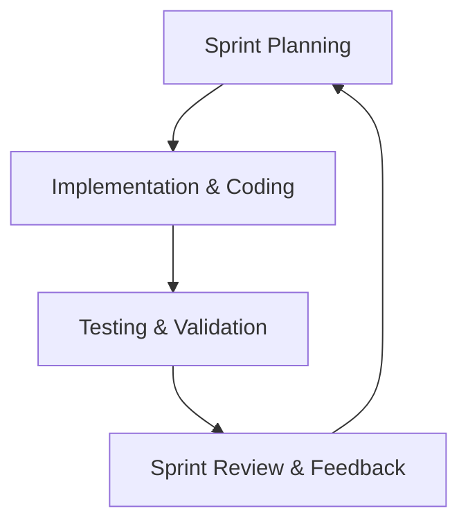
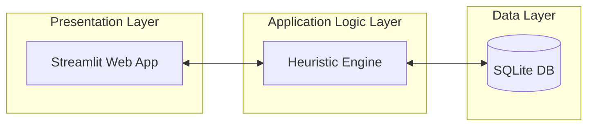
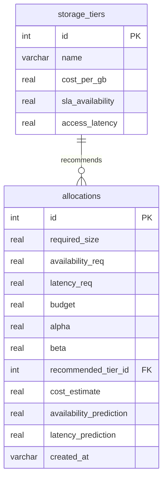
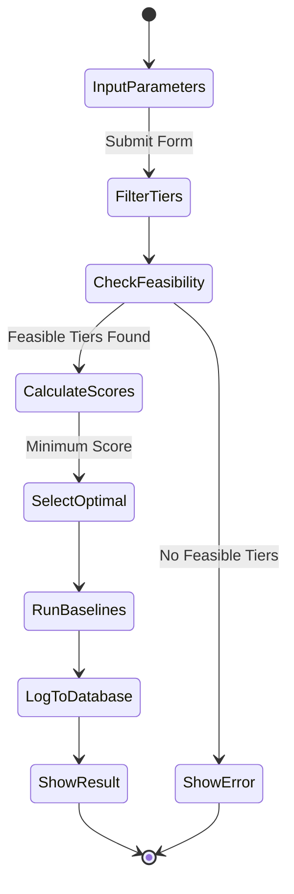

# CHAPTER THREE: METHODOLOGY AND SYSTEM DESIGN

## 3.0 Introduction
This chapter presents the methodology and system design of the SLA-Aware Storage Resource Allocation Optimizer. It details the research approach, requirements analysis, system design, tools, database schema, and the mathematical scoring algorithm used to allocate storage resources. Additionally, it outlines the validation and testing plans to evaluate the performance of the proposed greedy heuristic scoring approach against traditional baselines.

---

## 3.1 Research Methodology

### 3.1.1 Research Approach
This study adopts the **Design Science Research (DSR)** methodology. DSR is a problem-solving paradigm that guides the design, implementation, and evaluation of software artifacts to address real-world business and technical challenges. In this study, the artifact developed is an SLA-aware cloud storage allocation simulation software that uses a multi-objective greedy heuristic algorithm to minimize storage costs while satisfying customer availability and latency SLAs.

### 3.1.2 Data Collection Methods
Because deploying this system in a real-world cloud environment is costly and carries risks of data loss during testing, data is collected and processed through simulation. 
*   **Simulation Dataset:** Historical client requests are generated using public cloud storage characteristics (Block, File, and Object tiers).
*   **Attributes Collected:** Each request profile contains storage capacity demand (GB), SLA availability requirements (%), access latency requirements (ms), and budget constraints ($).
*   **Mock Generator:** A simulation script (`mock_data.py`) generates random requests based on real-world workload characteristics to populate the database for trend and compliance analysis.

### 3.1.3 System Development Methodology
The system was developed using the **Agile Software Development methodology**, specifically the **Scrum** framework. Scrum is selected due to its iterative nature, enabling continuous refinement of the heuristic algorithm, database schema, and frontend UI in short development sprints.



---

## 3.2 Requirements Analysis

### 3.2.1 Functional Requirements (FR)
Functional requirements describe the core actions and operations the software must perform.

*   **FR1: Requirement Input Capture:** The system must capture user storage needs, including required storage capacity (GB), maximum tolerable access latency (ms), target SLA availability (99.0% to 99.999%), and optional budget constraints.
*   **FR2: Heuristic Recommendation:** The system must run a multi-objective scoring heuristic based on user input to identify the most cost-effective storage tier.
*   **FR3: Baseline Comparison:** The system must execute traditional baseline algorithms (First Fit, Best Fit, Worst Fit) for the same inputs to provide comparative data.
*   **FR4: Historical Log Logging:** All generated recommendations must be recorded in a local SQLite database for compliance audit.
*   **FR5: Visualization Dashboard:** The system must display graphical breakdowns of storage growth, cost trends, and tier utilization.
*   **FR6: Report Export:** Users must be able to export detailed historical logs to a CSV file.

### 3.2.2 Non-Functional Requirements (NFR)
Non-functional requirements specify the quality attributes and constraints of the system.

*   **NFR1: Performance & Latency:** The recommendation engine must calculate scores and return a recommended tier in less than 500 milliseconds.
*   **NFR2: Usability:** The user interface must be clean, web-based, and intuitive, utilizing interactive input sliders and dropdown selections.
*   **NFR3: Reliability:** The SQLite database must maintain transactional integrity (ACID properties) to ensure that allocation records are never corrupted.
*   **NFR4: Portability:** The application must run on any modern web browser via the Streamlit server framework on Windows, macOS, or Linux.

---

## 3.3 Tools and Technologies

The technologies selected for implementation are chosen for their lightweight nature, performance, and compatibility:

*   **Python 3.8+:** Chosen as the primary programming language because of its rich scientific ecosystem, readability, and compatibility with data analysis libraries.
*   **Streamlit (v1.32.2):** Selected as the frontend framework. It abstracts HTML/CSS and enables rapid deployment of interactive data-driven dashboards directly in Python.
*   **SQLite3:** Utilized as the database management system. SQLite is zero-configuration, serverless, and stores data in a single file, making it highly portable.
*   **Pandas & NumPy:** Used for structural data frames and mathematical computations during scoring and log processing.
*   **Plotly Express:** Used to generate high-performance, interactive charts (pie charts, line graphs, and scatter plots) for the dashboard.
*   **Visual Studio Code (VS Code):** Used as the primary Integrated Development Environment (IDE).

---

## 3.4 System Design

### 3.4.1 System Architecture
The application is structured using a **Three-Tier Architectural Model** to maintain separation of concerns:



1.  **Presentation Layer:** Built with Streamlit, handling the web interface, rendering metrics cards, data tables, and input forms.
2.  **Application Logic Layer:** The core recommendation engine (`heuristic.py`) containing the greedy scoring mathematical algorithm.
3.  **Data Layer:** The SQLite database (`database.py` and `storage_allocation.db`), responsible for schema storage, querying, and logging.

### 3.4.2 Use Case Diagram
The use case diagram highlights the system interactions available to the Storage Administrator:

```mermaid
usecaseDiagram
    actor "Storage Administrator" as Admin
    
    Admin --> (Input Allocation Request)
    Admin --> (View Performance Dashboard)
    Admin --> (Monitor Storage Growth Trends)
    Admin --> (Export Compliance Reports)
```

### 3.4.3 Database Design (Entity Relationship Diagram)
The database structure is normalized into two relational tables to minimize data redundancy:



### 3.4.4 Activity Diagram (Allocation Process)
The workflow for evaluating and logging a storage allocation recommendation is detailed below:



### 3.4.5 Input and Output Design
*   **Input Design:** The simulation interface consists of a Streamlit sidebar menu for navigation, a main input form for storage parameters (GB, MS, SLA), and an adjustable slider for the Provider Control Weight ($\alpha$).
*   **Output Design:** Output is displayed using four-column KPIs showing recommended storage tier, monthly cost estimate, SLA availability, and access latency. A comparative pandas dataframe displays baseline comparison details.

---

## 3.5 Heuristic Algorithm and Model Description

### 3.5.1 Multi-Objective Heuristic Scoring Model
The system optimizes two conflicting objectives: **minimizing cost** and **maximizing availability**. Since cost ($) and unavailability (%) are measured in different units, they are normalized using Min-Max scaling to a scale of $[0, 1]$:

$$C_{\text{norm}}(i) = \frac{\text{Cost}(i) - \text{Cost}_{\text{min}}}{\text{Cost}_{\text{max}} - \text{Cost}_{\text{min}}}$$

$$U_{\text{norm}}(i) = \frac{\text{Unavailability}(i) - \text{Unavailability}_{\text{min}}}{\text{Unavailability}_{\text{max}} - \text{Unavailability}_{\text{min}}}$$

Where unavailability is calculated as:
$$\text{Unavailability}(i) = 1.0 - \left( \frac{\text{Availability}(i)}{100} \right)$$

The final score for storage tier $i$ is calculated as a weighted sum:
$$\text{Score}(i) = \alpha \times C_{\text{norm}}(i) + \beta \times U_{\text{norm}}(i)$$

Subject to the constraints:
$$\text{Availability}(i) \ge \text{Availability Requirement}$$
$$\text{Latency}(i) \le \text{Latency Requirement}$$
$$\text{Cost}(i) \le \text{Budget Constraint}$$
$$\alpha + \beta = 1.0$$

The tier that **minimizes** the weighted score is recommended. The weighting coefficient $\alpha$ is dynamic, allowing providers to prioritize cost reduction ($\alpha \to 1.0$) or high availability compliance ($\alpha \to 0.0$).

### 3.5.2 Traditional Baseline Algorithms
To evaluate performance, three traditional single-objective algorithms are implemented:
*   **First Fit (FF):** Scans the database tiers in order and selects the first tier that satisfies availability and latency constraints.
*   **Best Fit (BF):** Scans all eligible tiers and selects the one that minimizes availability slack ($\text{Availability}(i) - \text{Availability Requirement}$), minimizing over-provisioning.
*   **Worst Fit (WF):** Selects the tier that maximizes availability slack, resulting in maximum over-provisioning.

### 3.5.3 Heuristic Engine Pseudocode
The exact logic implemented in `heuristic.py` is represented below:

```text
ALGORITHM allocate_storage
    INPUT: required_size, availability_req, latency_req, budget, alpha, beta
    OUTPUT: recommended_tier, cost_estimate, availability_pred, latency_pred, baselines

    // Step 1: Query all storage tiers from SQLite
    tiers = GET_ALL_STORAGE_TIERS()
    
    // Step 2: Filter by constraints
    eligible_tiers = []
    FOR EACH tier IN tiers:
        IF tier.sla_availability >= availability_req AND tier.access_latency <= latency_req THEN
            tier.total_cost = tier.cost_per_gb * required_size
            IF budget IS NULL OR tier.total_cost <= budget THEN
                ADD tier TO eligible_tiers
            END IF
        END IF
    
    IF eligible_tiers is empty THEN
        RETURN Failure("No feasible storage tier meets requirements")
    END IF

    // Step 3: Compute Unavailability and Min-Max Limits
    FOR EACH tier IN eligible_tiers:
        tier.unavailability = 1.0 - (tier.sla_availability / 100.0)

    min_cost = MIN(eligible_tiers.total_cost)
    max_cost = MAX(eligible_tiers.total_cost)
    min_unavail = MIN(eligible_tiers.unavailability)
    max_unavail = MAX(eligible_tiers.unavailability)

    cost_range = max_cost - min_cost
    unavail_range = max_unavail - min_unavail

    // Step 4: Calculate Normalized Weighted Score
    FOR EACH tier IN eligible_tiers:
        c_norm = (cost_range > 0) ? (tier.total_cost - min_cost) / cost_range : 0.0
        u_norm = (unavail_range > 0) ? (tier.unavailability - min_unavail) / unavail_range : 0.0
        tier.score = alpha * c_norm + beta * u_norm

    // Step 5: Select Minimum Score
    best_tier = tier IN eligible_tiers WITH MINIMUM tier.score
    
    // Step 6: Compute Baselines
    first_fit = SELECT_FIRST_FIT(tiers, required_size, availability_req, latency_req)
    best_fit = SELECT_BEST_FIT(eligible_tiers, availability_req)
    worst_fit = SELECT_WORST_FIT(eligible_tiers, availability_req)

    RETURN Success(best_tier, first_fit, best_fit, worst_fit)
END ALGORITHM
```

---

## 3.6 Data Description

The system processes data attributes characterized as follows:

| Field Name | Data Type | Database Constraint | Description |
| :--- | :--- | :--- | :--- |
| `id` | INTEGER | PRIMARY KEY AUTOINCREMENT | Unique identifier for each allocation record. |
| `required_size` | REAL | NOT NULL | The size of storage requested by the client in Gigabytes (GB). |
| `availability_req` | REAL | NOT NULL | The minimum availability SLA percentage requested (e.g. 99.9%). |
| `latency_req` | REAL | NOT NULL | The maximum tolerable retrieval access latency in milliseconds (ms). |
| `budget` | REAL | NULLABLE | The maximum dollar budget allocation limit. |
| `alpha` | REAL | DEFAULT 0.5 | The cost optimization objective weight factor. |
| `beta` | REAL | DEFAULT 0.5 | The availability SLA compliance weight factor. |
| `recommended_tier_id` | INTEGER | FOREIGN KEY REFERENCES `storage_tiers(id)` | The ID of the storage tier recommended by the algorithm. |
| `cost_estimate` | REAL | NOT NULL | The calculated monthly cost of the allocation. |
| `availability_prediction` | REAL | NOT NULL | The actual SLA availability rate provided by the selected tier. |
| `latency_prediction` | REAL | NOT NULL | The access latency rate provided by the selected tier. |
| `created_at` | TEXT | NOT NULL | Timestamp indicating when the allocation was requested. |

---

## 3.7 Validation and Testing Plan

### 3.7.1 Testing Approach
The system undergoes dynamic testing during development to verify both functional performance and the mathematical accuracy of the scoring model.

### 3.7.2 Types of Testing
*   **Unit Testing:** Individual software functions, such as the mathematical score normalizations and individual baseline selectors (First Fit, Best Fit, Worst Fit) in `heuristic.py`, are verified against manual mathematical calculations.
*   **Integration Testing:** Verifies the database connection, ensuring that saving an allocation in the UI correctly commits a row to the SQLite database and updates dashboard metrics.
*   **System Testing:** End-to-end testing of the Streamlit application. This is validated by filling out the allocation form and ensuring that correct recommended tiers and comparative charts render on-screen.

---

## 3.8 Ethical and Security Considerations

*   **Data Privacy:** The application does not collect, store, or transmit any Personal Identifiable Information (PII). All storage demands, logs, and simulated allocations represent corporate client infrastructure metadata.
*   **Database Security:** Since SQLite is stored locally, data access security is managed by file-system user permissions. The SQLite connection uses parameterized queries during inputs (FR4) to prevent SQL Injection exploits.
