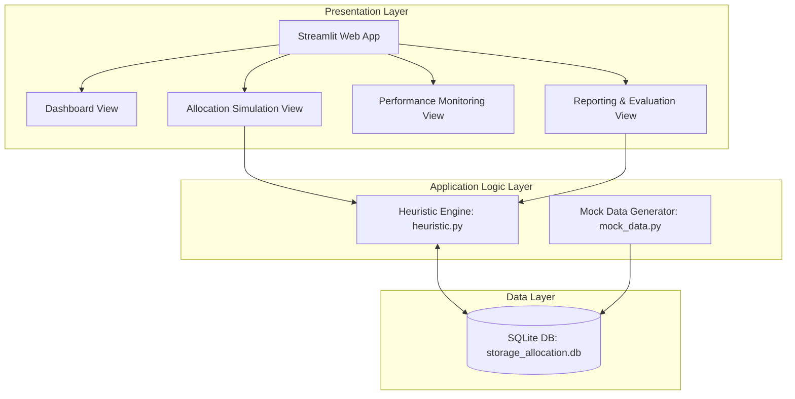
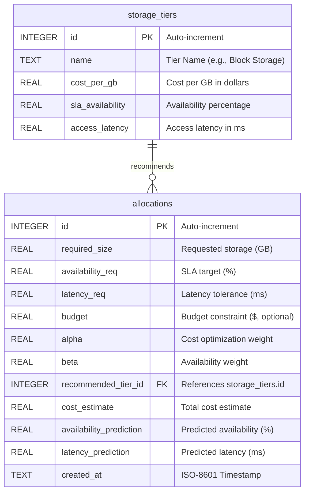

# SLA-Aware Cloud Storage Resource Allocation Optimizer: Complete System Guide

Welcome to the comprehensive documentation for the **SLA-Aware Cloud Storage Resource Allocation Optimizer**. This guide provides an in-depth explanation of the system architecture, mathematical optimization model, setup instructions, database schema, and usage of the Streamlit-based interface.

---

## 1. System Overview & Architecture

The system is a web-based simulation and optimization application designed to solve the problem of selecting the most cost-effective cloud storage tier for diverse application workloads. Selecting storage manually is complex because it requires balancing multiple competing factors:
*   **Operational Cost ($ per GB)**: Minimizing expenses.
*   **Service Level Agreement (SLA) Availability (%)**: Guaranteeing uptime.
*   **Workload Performance (Latency in ms)**: Meeting access speed requirements.
*   **Budget Boundaries ($)**: Staying within predefined cost limits.

The application implements a custom **multi-objective greedy scoring heuristic** that balances these factors according to user-configurable preferences.

### Three-Tier Architecture

The system is designed around a three-tier architecture to separate presentation, business logic, and persistence:



1. **Presentation Layer (Streamlit UI)**: Provides an interactive dashboard, input forms, dynamic metric cards, and charts generated via Plotly.
2. **Application Logic Layer (Python Algorithms)**: Evaluates requests against constraints, normalizes metrics, calculates optimal scores using the heuristic algorithm, and calculates comparisons against standard baselines.
3. **Data Layer (SQLite Database)**: Persists storage tier attributes and records every generated allocation for historical auditing.

---

## 2. Heuristic Optimization Algorithm

The core engine utilizes a **multi-objective greedy scoring heuristic** based on a weighted sum of normalized cost and normalized unavailability objectives.

### Mathematical Model

Let $T$ be the set of available storage tiers. For each tier $i \in T$, we define:
*   $C(i)$: The total cost of allocating the requested storage size on tier $i$ ($Cost(i) = CostPerGB(i) \times RequiredSize$).
*   $A(i)$: The SLA availability percentage of tier $i$ (e.g., $99.999\%$).
*   $L(i)$: The access latency of tier $i$ in milliseconds (e.g., $2.0\text{ ms}$).

#### 1. Constraint Filtering
Before scoring, the algorithm filters out tiers that fail to satisfy basic constraints:
$$\text{Feasible Tiers } F = \{i \in T \mid A(i) \ge A_{\text{req}} \land L(i) \le L_{\text{req}} \land C(i) \le B\}$$

Where:
*   $A_{\text{req}}$ is the user's minimum availability requirement.
*   $L_{\text{req}}$ is the user's maximum latency tolerance.
*   $B$ is the optional user budget boundary (if $B > 0$).

#### 2. Min-Max Normalization
Because cost (in dollars) and availability (in percent) have completely different units and scales, they must be normalized to a $[0, 1]$ range.
First, availability is converted to **unavailability** because we want to minimize both cost and unavailability:
$$U(i) = 1.0 - \frac{A(i)}{100}$$

Normalization is calculated over the set of feasible tiers $F$:
$$C_{\text{norm}}(i) = \begin{cases} 
\frac{C(i) - C_{\text{min}}}{C_{\text{max}} - C_{\text{min}}} & \text{if } C_{\text{max}} > C_{\text{min}} \\ 
0.0 & \text{otherwise} 
\end{cases}$$

$$U_{\text{norm}}(i) = \begin{cases} 
\frac{U(i) - U_{\text{min}}}{U_{\text{max}} - U_{\text{min}}} & \text{if } U_{\text{max}} > U_{\text{min}} \\ 
0.0 & \text{otherwise} 
\end{cases}$$

Where $C_{\text{min}}, C_{\text{max}}$ and $U_{\text{min}}, U_{\text{max}}$ are the minimum and maximum cost and unavailability values within the feasible set $F$.

#### 3. Dual-Objective Scoring
The final score for each tier $i \in F$ is computed as:
$$\text{Score}(i) = \alpha \times C_{\text{norm}}(i) + \beta \times U_{\text{norm}}(i)$$

Subject to:
$$\alpha + \beta = 1.0 \quad (\alpha, \beta \ge 0)$$

*   $\alpha$ (Alpha): Weight assigned to cost optimization. A higher $\alpha$ prioritizes cheaper tiers.
*   $\beta$ (Beta): Weight assigned to SLA availability. A higher $\beta$ prioritizes higher availability. Since $\beta = 1.0 - \alpha$, configuring $\alpha$ automatically determines $\beta$.

**Decision Rule:** The algorithm selects the tier $i^*$ that minimizes the score:
$$i^* = \arg\min_{i \in F} \text{Score}(i)$$

### Baseline Comparison Algorithms

For evaluation, the system executes three traditional algorithms under identical conditions:
*   **First Fit (FF)**: Scans the tiers in database order (Block, File, Object) and selects the very first tier that meets constraints, regardless of cost or extra availability.
*   **Best Fit (BF)**: Selects the tier that meets constraints and minimizes the availability slack (i.e., minimizes $A(i) - A_{\text{req}}$) to prevent over-provisioning.
*   **Worst Fit (WF)**: Selects the tier that meets constraints and maximizes the availability slack (i.e., maximizes $A(i) - A_{\text{req}}$), representing safe over-provisioning.

---

## 3. Database Schema

The system uses an SQLite database named `storage_allocation.db`. The relational schema contains two main tables:



### Table Definitions

#### 1. `storage_tiers`
Stores the static parameters of modeled cloud storage offerings.
*   `id`: Primary key.
*   `name`: Name of the storage tier (e.g., *Block Storage*, *File Storage*, *Object Storage*).
*   `cost_per_gb`: Base storage cost per GB (e.g., $0.15, $0.08, $0.02).
*   `sla_availability`: Target availability percentage (e.g., 99.999%, 99.99%, 99.0%).
*   `access_latency`: Baseline access latency in milliseconds (e.g., 2.0 ms, 10.0 ms, 50.0 ms).

#### 2. `allocations`
Logs historical storage recommendation requests and recommendations generated by the system.
*   `id`: Primary key.
*   `required_size`: Required storage capacity in GB.
*   `availability_req`: User's minimum availability SLA target (%).
*   `latency_req`: User's maximum tolerable access latency (ms).
*   `budget`: User's budget limit in dollars (optional, nullable).
*   `alpha`: Cost optimization weight parameter ($\alpha$).
*   `beta`: Availability optimization weight parameter ($\beta = 1.0 - \alpha$).
*   `recommended_tier_id`: Foreign key referencing the selected tier in `storage_tiers`.
*   `cost_estimate`: Estimated total cost ($).
*   `availability_prediction`: Availability percentage of the recommended tier.
*   `latency_prediction`: Access latency of the recommended tier.
*   `created_at`: Date and time the request was processed (ISO format).

---

## 4. Setup and Installation Guide

### Prerequisites
*   Python 3.8 or higher.
*   SQLite3 (comes pre-bundled with Python's standard library).

### Installation Steps

1.  **Clone or Navigate to the Workspace Directory**:
    ```bash
    cd /home/haadi/Desktop/project-work/Eunice-Btech/cloud-optimized
    ```

2.  **Create a Virtual Environment**:
    It is recommended to use a virtual environment to isolate project dependencies.
    ```bash
    python3 -m venv .venv
    ```

3.  **Activate the Virtual Environment**:
    *   On Linux/macOS:
        ```bash
        source .venv/bin/activate
        ```
    *   On Windows:
        ```cmd
        .venv\Scripts\activate
        ```

4.  **Install Required Dependencies**:
    The system requires Streamlit, Pandas, and Plotly:
    ```bash
    pip install -r requirements.txt
    ```

5.  **Initialize and Seed Mock Data (Recommended)**:
    To see charts and data immediately in the dashboard, run the mock data generator. This seeds the SQLite database with 20 historical allocations spread over the last 30 days:
    ```bash
    python mock_data.py
    ```

6.  **Run the Streamlit Web Application**:
    Launch the Streamlit server:
    ```bash
    streamlit run app.py
    ```
    Once started, the CLI will output local and network URLs (usually `http://localhost:8501`). Open your browser of choice to access the UI.

---

## 5. UI Walkthrough & How to Use the System

The Streamlit interface features a sidebar navigation panel with four modules:

```text
Sidebar Navigation
 ├── Dashboard
 ├── Allocation Simulation
 ├── Performance Monitoring
 └── Reporting & Evaluation
```

### Module 1: Dashboard
This screen provides a high-level operational overview of all storage resources allocated through the system.

*   **KPI Metric Cards**: Displays total storage volume (GB), total estimated cost ($), total requests, and the system-wide SLA Compliance Rate (percentage of allocations where the recommended tier successfully met or exceeded the user's constraints).
*   **Cost by Storage Tier**: An interactive 3D-styled pie chart showing the percentage of total budget allocated to Block, File, and Object storage tiers.
*   **Allocation Size by Storage Tier**: A vertical bar chart comparing the total capacity allocated to each storage tier.
*   **Recent Allocations**: A quick-access table listing the five most recent allocation records.

### Module 2: Allocation Simulation
This is the interactive engine where administrators can input requirements to find the optimal storage tier.

#### Step-by-Step Simulation:
1.  **Enter Storage Size**: Specify the capacity required in GB.
2.  **Specify Latency**: Input the maximum tolerable access latency in milliseconds (e.g., database servers require low numbers like `5 ms`, whereas document storage can tolerate higher values).
3.  **Select Availability SLA**: Choose the target uptime percentage (`99.0%`, `99.9%`, `99.99%`, `99.999%`).
4.  **Define Budget (Optional)**: Input a maximum dollar cap. If no tier fits this budget and meets the constraints, the system displays an error and indicates the closest available option.
5.  **Adjust Weight Sliders**: Use the **Alpha** slider to adjust priority:
    *   *High Alpha (0.8 - 1.0)*: Prioritizes cost reduction. The system will favor cheaper tiers even if they have lower availability (as long as they meet the minimum constraint).
    *   *Low Alpha (0.0 - 0.2)*: Prioritizes reliability. The system will choose more robust, higher-availability tiers (like Block Storage) even if they cost more.
6.  **Click Generate Recommendation**:
    *   **Recommendation Details**: Displays the winning tier, its cost, SLA availability, access latency, and weights.
    *   **Algorithm Comparative Analysis**: Displays a table comparing the proposed Heuristic recommendation against First Fit, Best Fit, and Worst Fit, checking feasibility and costs.
    *   **Data Saving**: The recommendation is automatically logged into the SQLite database.

### Module 3: Performance Monitoring
This module provides time-series charts to track storage utilization trends and plan capacity expansions.

*   **Storage Growth Trend**: A markers-enabled line chart tracking the cumulative capacity (GB) requested over time.
*   **Cost Trend Analysis**: A filled area chart displaying cumulative cost growth over time.
*   **Allocation Profiles Scatter Plot**: Plots size (X-axis) against maximum tolerable latency (Y-axis), color-coded by storage tier. The sizes of the scatter bubbles represent estimated monthly costs, allowing administrators to spot outlier requests instantly.

### Module 4: Reporting & Evaluation
Designed for compliance auditors and systems managers.

*   **Algorithm Historical Performance Comparison**: Re-simulates historical requests against all baseline algorithms (First Fit, Best Fit, Worst Fit) and compares:
    1.  *Cumulative Historical Cost ($)*: Showcases how much money the proposed heuristic saves compared to other selection rules.
    2.  *SLA Compliance Rate (%)*: Evaluates if safety rules were maintained.
*   **Operational Cost Comparison Chart**: A Plotly bar chart comparing the total cumulative costs of all algorithms side-by-side.
*   **SLA Compliance Log**: A complete tabular checklist showing whether each past allocation successfully met its constraints.
*   **Cost Optimization Insights**: Shows aggregated metrics grouped by tier, including average cost per GB allocated.
*   **Report Export**: Features a "Download Full Report (CSV)" button, allowing users to export the entire history into Excel or compliance reports.

---

## 6. Troubleshooting & FAQs

> [!NOTE]
> **Why am I getting "Why am I getting 'No single storage tier meets both the Availability and Latency requirements'"?**
> This means that no available storage tier satisfies your constraints. For example, if you require `99.999%` availability (only met by Block Storage) but also specify a latency tolerance of `1.0 ms` (when Block Storage provides `2.0 ms`), no tier is feasible. Relax either your availability target or latency tolerance.

> [!WARNING]
> **Why am I getting "No storage tier meets the requirements within budget"?**
> This happens when one or more storage tiers meet your latency and availability requirements, but their total monthly cost exceeds the budget limit you specified. Relax your budget constraint or decrease the required storage size.

> [!TIP]
> **How do I customize the storage tiers and pricing?**
> The storage tiers are stored in the `storage_tiers` table in the database. If cloud pricing or tier properties change, you can update them directly in SQLite or edit the seeding block in `database.py` (lines 50–54) and re-initialize the database.
